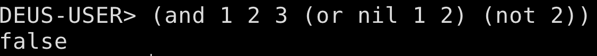
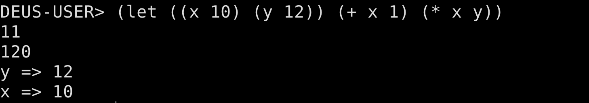

# DeusCL

I am starting this project as a complete beginner to Lisp, Interpreters/REPL and Rust in general. Through the project I hope to have a deeper dive into what a REPL is and what exatly goes into buildng a Lisp implementation. Because, of the research I have to do for this project I expect it to last for my entire semester, but only my commit history can tell how far down I will go with this project. I also have a research folder where I hope to detail all my notes in this process, maybe it might help me as I take my coding journey into the world of lisp.

# Structure of this Project

This readme and the project is general is living right now until maybe I decide to give up on it, but until then I will keep working on it. All the readmes within this project are living and I will keep on updating them as I summarize my findings and results.

# Requirements

1. Rust
2. Cargo

Installing Rust and Cargo on Linux and macOS you can do the following:

```
curl https://sh.rustup.rs -sSf | sh
```

Installing on Windows you can just use this link https://static.rust-lang.org/rustup/dist/i686-pc-windows-gnu/rustup-init.exe.


# Running the REPL

You can run the REPL, doing the following in a terminal:
```
git clone https://github.com/xinslu/deusCL.git
cd deusCL/code
cargo run
```

# Images

## Arithmetic Operations in DeusCL


## Logical Operations in DeusCL



## Local Variable Creation and usage in DeusCL


